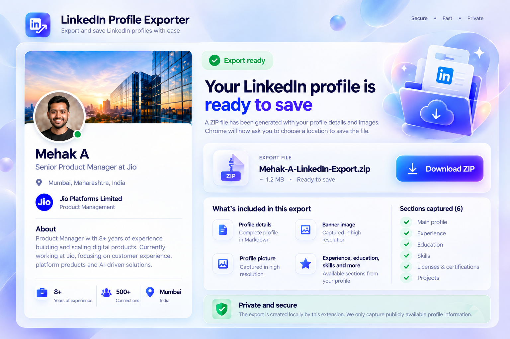

<p align="center">
  
</p>

<h1 align="center">LinkedIn Profile Exporter</h1>

<p align="center">
  <strong>Turn the LinkedIn profile open in Chrome into a clean, AI-ready local package.</strong>
</p>

<p align="center">
  Export supported profile sections to Markdown, keep the available profile picture and banner, and use the result as structured context with ChatGPT, Claude or your own tools.
</p>

<p align="center">
  <a href="https://github.com/PiyushWavre/linkedin-profile-exporter/releases/latest"></a>
  
  
  <a href="LICENSE"></a>
</p>

<p align="center">
  <a href="https://piyushwavre.github.io/linkedin-profile-exporter/">Project site</a> ·
  <a href="#install">Install</a> ·
  <a href="#privacy">Privacy</a> ·
  <a href="CONTRIBUTING.md">Contribute</a>
</p>



## Why I built this

A common workflow is to ask an AI assistant to review a LinkedIn profile, improve the About section, rewrite experience descriptions or help turn career history into a CV.

The awkward part is giving the AI enough context. You can take screenshots, copy sections one by one, download a PDF and explain what is missing, or manually build a document from your profile.

**LinkedIn Profile Exporter removes that repetitive step.** Open a profile you can already access in Chrome, run the extension, and it creates a clean local ZIP with structured Markdown plus available profile images.

You can keep the export as a local reference or upload the Markdown/ZIP to an AI tool when you choose. The extension itself does not send your export to ChatGPT, Claude or any other AI service.

> When you upload an export to a third-party AI service, that service's own privacy and data-use terms apply.

## How it works

1. **Open a LinkedIn profile** you can access at `linkedin.com/in/...`.
2. **Start the export.** The extension captures the main profile and the supported detail sections that are actually available.
3. **Review the export window.** It shows the captured profile summary, available images and section counts.
4. **Click Download ZIP.** The download starts only when you choose it. If Chrome's Save dialog is cancelled, the same prepared export stays available for retry.

The original LinkedIn profile stays open while the finished export appears in a separate app-style window.

## What the ZIP contains

```text
Profile-Name-LinkedIn-Export.zip
├── Profile-Name.md
├── Profile-Picture.jpg     # when available
└── Banner-Image.jpg        # when available
```

The Markdown can include:

- Profile summary and About
- Experience
- Education
- Licences & Certifications
- Projects
- Skills
- Publications
- Patents
- Honours & Awards
- Languages
- Volunteering
- Courses
- Test Scores
- Organizations
- Services
- Causes

Every supported section is optional. If LinkedIn shows the data, the exporter captures it. If a section is absent, it is skipped and the export continues.

**Featured, Recommendations, Activity and Interests are intentionally excluded.**

Supporting fields are optional too. For example, a language can be exported even when LinkedIn does not show a proficiency value. Language names are not limited to a hard-coded list.

## Use the export as AI context

The extension does not perform AI analysis itself. It creates cleaner source material that you can choose to use elsewhere.

Example prompts after uploading your export:

> Review my LinkedIn profile for positioning, clarity and missing information. Preserve the facts and do not invent achievements.

> Rewrite my About section using the experience already present in this profile. Keep the tone practical and professional.

> Review each experience entry and suggest clearer wording. Separate factual gaps from writing improvements.

> Use this LinkedIn export as background context while helping me prepare a CV. Ask before adding any fact that is not present in the source.

The Markdown is also useful for local search, archiving, portfolio work, career coaching and your own scripts or tools.

## Install

### Option 1: GitHub Release

1. Open the [latest release](https://github.com/PiyushWavre/linkedin-profile-exporter/releases/latest).
2. Download the release ZIP and extract it to a permanent folder.
3. Open `chrome://extensions`.
4. Enable **Developer mode**.
5. Select **Load unpacked**.
6. Choose the extracted folder containing `manifest.json`.
7. Refresh any LinkedIn profile tabs that were already open.

### Option 2: Clone the repository

```bash
git clone https://github.com/PiyushWavre/linkedin-profile-exporter.git
cd linkedin-profile-exporter
npm run check
```

Then load the repository folder as an unpacked extension from `chrome://extensions`.

No compilation or application server is required. The extension runtime has no third-party JavaScript dependencies.

## Privacy

<a id="privacy"></a>

LinkedIn Profile Exporter is designed as a **local-first** browser extension.

- No analytics or telemetry
- No application backend
- No automatic cloud upload of exported profiles
- No remote executable code
- ZIP creation happens inside the extension
- Download begins only after you click **Download ZIP**

The extension requests access to LinkedIn pages and LinkedIn image hosts because that is where the profile and its available images are rendered.

| Permission | Purpose |
| --- | --- |
| `downloads` | Save the ZIP and observe whether Chrome completes or interrupts the requested download. |
| `storage` | Keep short-lived export state while the Manifest V3 service worker sleeps or restarts. |
| `alarms` | Bound capture operations and clean up expired job state. |
| `https://www.linkedin.com/*` | Read and navigate the profile the user explicitly exports. |
| `https://*.licdn.com/*` | Retrieve available profile/banner images from LinkedIn image hosts. |

The broad `tabs` permission is not requested.

Read the full [privacy policy](PRIVACY.md) and [security policy](SECURITY.md).

## Scope and limitations

This project is designed for a user to export **the profile currently open and accessible in their own browser session**.

It does not provide:

- bulk profile crawling;
- login automation;
- access-control bypassing;
- hidden/private profile extraction;
- a server-side collection pipeline.

LinkedIn changes its page structure over time. The exporter uses bounded waits, multiple supported DOM patterns and conservative fallbacks, but no browser extension can guarantee that every future LinkedIn layout will remain compatible without maintenance.

Users are responsible for complying with LinkedIn's terms, applicable privacy requirements and the rights of the people whose information they export.

## Development

The repository is intentionally lightweight.

Requirements:

- Chrome 116 or newer for the extension
- Node.js 20 or newer for repository validation

Run:

```bash
npm run check
```

Create an installable release ZIP:

```bash
npm run package:release
```

The package script writes the extension-only archive to `dist/` and excludes repository/community documentation from the installable extension.

### Project structure

```text
.github/                 GitHub Actions, issue forms and PR template
core/                    Shared runtime, model, state and image helpers
docs/                    Architecture notes and GitHub Pages site
icons/                   Extension icons
sections/                Supported LinkedIn section parsers
scripts/                 Validation and release packaging
content.js               Visible profile/detail capture
service-worker.js        Export job orchestration and navigation
exporter.js              Profile merge and Markdown generation
download.*               Dedicated export-ready window
popup.*                  Extension popup
zip.js                   Dependency-free ZIP writer
manifest.json            Chrome Manifest V3 configuration
```

For the capture architecture, see [docs/ARCHITECTURE.md](docs/ARCHITECTURE.md).

## Contributing

Bug fixes, new LinkedIn DOM variants, accessibility improvements and reliability work are welcome.

Please read [CONTRIBUTING.md](CONTRIBUTING.md) before opening a pull request. Public issues and screenshots must not contain exported profiles, contact information, cookies, signed URLs or other personal data.

## Author

**Piyush Wavre**  
Creator and maintainer of LinkedIn Profile Exporter.

## Trademark notice

LinkedIn is a trademark of LinkedIn Corporation. LinkedIn Profile Exporter is an independent open-source project and is not affiliated with, endorsed by or sponsored by LinkedIn Corporation or Microsoft.

## License

[MIT](LICENSE) © 2026 Piyush Wavre.
